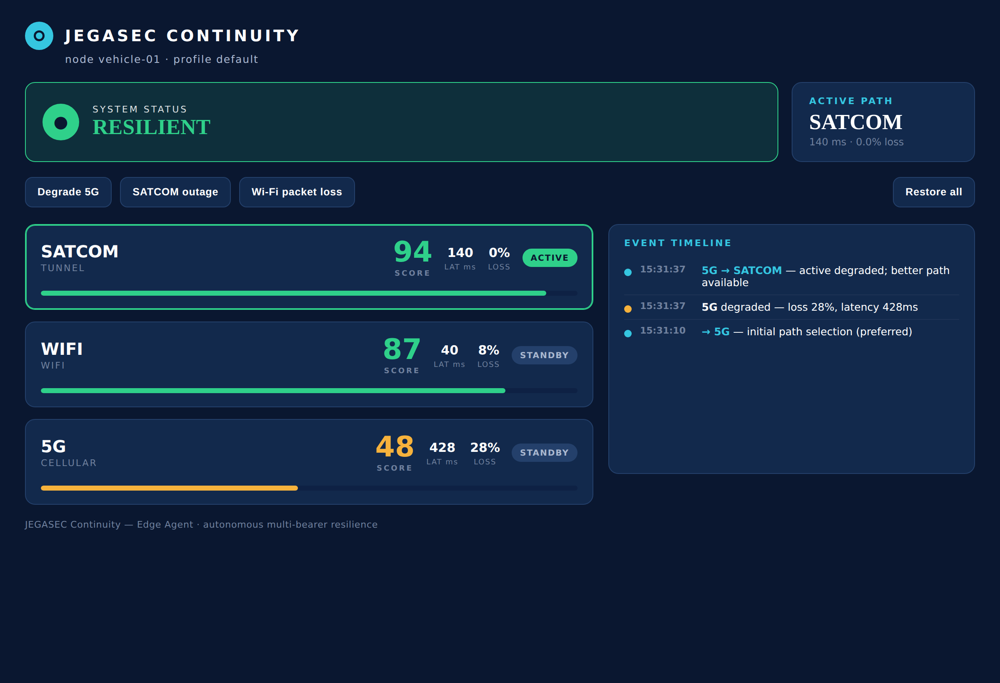

# JEGASEC Continuity — Edge Agent

> Keeps mission-critical systems connected when their networks degrade or fail.

Continuity is edge-deployed software that maintains application connectivity
across multiple communications bearers — cellular, satellite, radio, Wi-Fi and
wired — when individual links become congested, degraded, jammed or unavailable.

This repository is the **Continuity Edge Agent**. It now covers **Sprints 1–7**
of the 0.1 demonstrator: interface discovery, link telemetry, scoring, the
policy engine with hysteresis, automated failover, a degradation simulator, and
a live web dashboard. It is hardware-agnostic, runs on standard Linux, has
**zero external dependencies**, and needs no cloud connectivity.



*Live dashboard after a simulated 5G degradation: the agent has autonomously
failed over 5G → SATCOM and logged the decision, staying RESILIENT throughout.*

## Try the demo (no root, no radios)

Requires Go 1.24+.

```sh
go run ./cmd/continuity serve --sim
# open http://127.0.0.1:8080  →  click "Degrade 5G" and watch it fail over
```

The `--sim` flag runs the whole control loop over a built-in simulator, so you
can drive DEGRADE / OUTAGE / RESTORE from the dashboard and see real scoring,
policy and failover decisions — without touching the network.

## Or inspect real bearers

```sh
go run ./cmd/continuity --once            # single scan of this host, table output
go run ./cmd/continuity --profile voice   # continuous, voice-weighted scoring
go run ./cmd/continuity --json            # machine-readable
go run ./cmd/continuity serve             # live dashboard over real interfaces
```

```
JEGASEC Continuity  ·  node vehicle-01  ·  profile default

  BEARER  TYPE      ADDRESS       LAT(ms)  JIT(ms)  LOSS  ROLE     SCORE
  wwan0   cellular  10.12.4.8     28       4        0%    PRIMARY   88.6  █████████·
  sat0    tunnel    100.72.0.3    140      18       0%    BACKUP    84.1  ████████··
  wlan0   wifi      192.168.1.20  85       9        12%   STANDBY   47.4  ████······
```

## How it works

1. **Discover** every network interface and classify it by bearer type
   (`internal/interfaces`).
2. **Measure** live latency, jitter and packet loss per bearer — each probe
   source-bound so bearers are measured independently (`internal/telemetry`).
3. **Score** each bearer 0–100 under an explicit, weighted, explainable model
   with per-application profiles (`internal/scoring`).
4. **Decide** with hysteresis — rest on the preferred bearer, migrate only when
   another is clearly and persistently better, fail back on recovery, never flap
   (`internal/policy`).
5. **Act** by making the chosen bearer the active route (`internal/routing`;
   DryRun by default, real Linux routing with `--apply`).
6. **Observe** through an event log, REST API and dashboard (`internal/events`,
   `internal/api`).

The `internal/agent` package is the control loop tying these together over a
pluggable live-or-simulated source.

## REST API (spec §22)

| Method & path | Purpose |
|---|---|
| `GET /api/v1/state` | Full snapshot (node, status, active path, bearers, events) |
| `GET /api/v1/node` | Node id, status, active interface |
| `GET /api/v1/interfaces` | All bearers with metrics + score + role |
| `GET /api/v1/interfaces/{name}` | One bearer |
| `GET /api/v1/events` | Recent decision / state-change events |
| `GET /api/v1/policy` | Active profile and traffic-class → profile map |
| `POST /api/v1/simulator/{name}/{degrade\|outage\|restore}` | Demo controls (sim mode) |

## Project layout

```
continuity/
  cmd/continuity/        # CLI: scan (sense) and serve (dashboard + API)
  internal/
    interfaces/          # Sprint 1 — discovery & classification
    telemetry/           # Sprint 2 — latency / jitter / loss / throughput
    scoring/             # Sprint 3 — weighted, explainable 0–100 score
    policy/              # Sprint 4 — traffic classes + hysteresis controller
    events/              # Sprint 4 — thread-safe event log
    routing/             # Sprint 5 — DryRun / Linux route managers
    simulator/           # Sprint 6 — synthetic bearers + tc/netem builders
    api/                 # Sprint 7 — REST API + embedded dashboard
    agent/               # control loop (live or simulated source)
    config/              # YAML-subset policy loader
```

## Configuration

Built-in defaults work out of the box; an optional YAML file overrides them (see
[`configs/continuity.example.yaml`](configs/continuity.example.yaml)). The loader
parses a small YAML subset with no third-party dependency.

## Testing

```sh
make test      # go test ./... -race -cover
make vet
make fmt
make build     # -> bin/continuity
```

Every package is unit-tested, including the failover state machine
(`internal/policy`) and an end-to-end failover-and-recovery run through the
orchestrator over the simulator (`internal/agent`).

## Roadmap

Sprints 1–7 (this repo) ✓ → hysteresis tuning & recovery polish (8) → encrypted
stable tunnel / session continuity (9) → the 90-second polished demonstration
(10). That completes **Continuity 0.1**; the product spec carries the roadmap
through 0.5 (design-partner MVP) to 2.0 (predictive resilience).

## Status & notes

- Route changes default to **DryRun** (recorded, not applied). `serve --apply`
  performs real Linux routing and requires `CAP_NET_ADMIN` (root).
- `--sim` drives the pipeline from a simulator; the `tc/netem` builders in
  `internal/simulator` impair real interfaces on a physical test bench.
- Engineering targets (sub-3-second failover, etc.) are design goals, not yet
  independently validated. Throughput is link capacity from sysfs; active
  measurement is future work.

## License

Proprietary — © 2026 Jegasec. All rights reserved. See [LICENSE](LICENSE).
